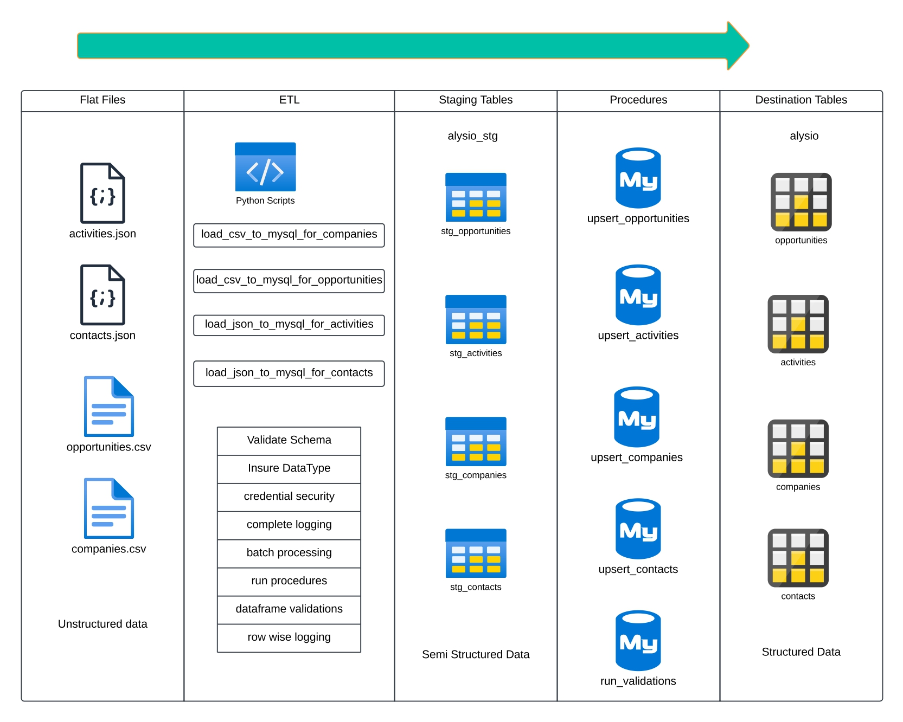

# CRM Data Engineering Challenge

## Objective
Create a SQLite database from provided CRM data, implementing data cleaning and proper relational schema design.

## Data Description
- `companies.csv`: Company profiles with industry and revenue data
- `contacts.json`: Contact information with potential duplicates
- `opportunities.csv`: Sales pipeline data
- `activities.json`: Customer interaction logs

## Requirements

### 1. Database Schema
- Design normalized tables with proper relationships
- Implement appropriate constraints and indexes
- Document schema design decisions

### 2. Data Cleaning
- Standardize company names and industries
- Remove duplicate contacts while preserving relationship integrity
- Normalize phone numbers and email addresses
- Handle missing values appropriately
- Validate date formats and ranges

### 3. Data Loading
- Create ETL pipeline to load data into SQLite
- Implement error handling and logging
- Validate referential integrity
- Create process for incremental updates


## Deliverables
1. SQLite database with cleaned data
2. Python scripts for ETL process
3. SQL schema creation scripts
4. Documentation of cleaning rules and assumptions
5. Sample queries demonstrating data access

## Evaluation Criteria
- Schema design and normalization
- Data cleaning methodology
- Code quality and organization
- Error handling
- Query performance
- Documentation quality

## Setup
```bash
python -m venv venv
source venv/bin/activate  # or `env\Scripts\activate` on Windows
pip install -r requirements.txt
python src/data_generator.py
```

## Submission
1. Fork this repository
2. Complete the challenge
3. Submit pull request with all deliverables


# Data Pipeline for Loading Data into MySQL Database

## Overview

This documentation outlines the automated Extract, Transform, Load (ETL) pipeline process that handles data ingestion, transformation, and loading from four flat files into a MySQL database. The ETL process ensures data integrity, security, and efficiency using Python scripts for automation.

## Source Files

The pipeline processes the following flat files:

- `companies.csv`
- `opportunities.csv`
- `contacts.json`
- `activities.json`

Each source file is loaded into its corresponding staging table with the suffix `_stg`. The target tables retain the original names without the suffix.

## Pipeline Workflow

### 1. File Reading
- Processes files in chunks to optimize memory usage.
- Uses `pandas.read_json()` with `lines=True` for JSON files.
- Uses `pandas.read_csv()` for CSV files with chunk processing.

### 2. Database Connection
- Secure connection to MySQL using credentials stored in environment variables.
- Environment variables are managed using the `os` Python module.

### 3. Batch Logging
- A batch record is created at the start and updated at the end of each pipeline run.
- Logs batch ID, start time, finish time, and status.

### 4. Data Validation and Schema Verification
- Utilizes `pandera` to validate data against predefined schemas.
- Schema mismatches and extra columns are logged.

### 5. Date Formatting
- All date columns are formatted before insertion.

### 6. Chunking for Efficiency
- Data is processed in chunks to manage large datasets efficiently.

### 7. Staging Table Loading
- Data is loaded into staging tables (`*_stg`) using `executemany()` for efficient batch inserts.
- Failed rows are logged for troubleshooting.

### 8. Upsert Process for Target Tables
- Ensures new records are inserted and existing records are updated.

### 9. Error Handling and Data Validation
- Columns `is_error` and `error_description` track data quality.
- Rows with critical errors (is_error = 1) are excluded from loading.

### 10. Incremental Loading
- Staging tables are truncated before each load.
- Target tables are updated incrementally.

### 11. Batch Status Update
- Logs completion status in the batch table for auditing.

## Entity Relationship Diagram (ERD)


## Process Flow



1. **Initialization**
    - Set up database connection.
    - Log batch start time.

2. **Processing Each Source File**
    - Read data in chunks.
    - Validate schema.
    - Format date columns.
    - Log errors.
    - Load data into staging tables.

3. **Upsert Process**
    - Load data from staging to target tables.

4. **Error Logging**
    - Detailed logs for failed rows.

5. **Completion**
    - Update batch record with completion status.

## Security and Credential Management

- Database credentials are securely stored in environment variables.
- Use the `os` module to access credentials during runtime.

## Local Setup Guide

### Prerequisites
Ensure the following are installed on your system:

- Python (>=3.8)
- MySQL Server
- MySQL Workbench (optional for database management)
- Virtualenv (for managing dependencies)

### Steps to Setup

1. **Clone the Repository:**
   ```sh
   git clone <repository-url>
   cd alysio-data-engineer-challenge
   ```

2. **Create and Activate Virtual Environment:**
   ```sh
   python -m venv venv
   # Windows
   venv\Scripts\activate
   # macOS/Linux
   source venv/bin/activate
   ```

3. **Install Dependencies:**
   ```sh
   pip install -r requirements.txt
   ```

4. **Set Up Environment Variables:**
   - Create a `.env` file in the project root with the following content:
   ```env
   MYSQL_HOST=localhost
   MYSQL_USER=root
   MYSQL_PASSWORD=yourpassword
   MYSQL_DATABASE=yourdatabase
   ```

5. **MySQL Database Setup:**
   - Start the MySQL server.
   - Open MySQL Workbench or command line and run:
   ```sql
   CREATE DATABASE yourdatabase;
   ```
   - Create necessary tables using the provided schema.

6. **Run the ETL Pipeline:**
   ```sh
   python main.py
   ```

7. **Verify the Logs:**
   - Check logs in the `logs/` directory for success/failure messages.

### Troubleshooting

- Ensure MySQL service is running.
- Verify environment variables are correctly set.
- Check the error logs in the `logs/` folder for troubleshooting.

## Conclusion

This ETL pipeline provides an efficient, secure, and automated process for data ingestion, validation, transformation, and loading into MySQL. It ensures reliable data handling through error logging, incremental updates, and robust schema validation.
